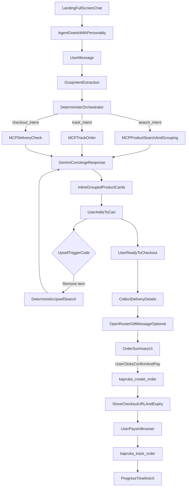
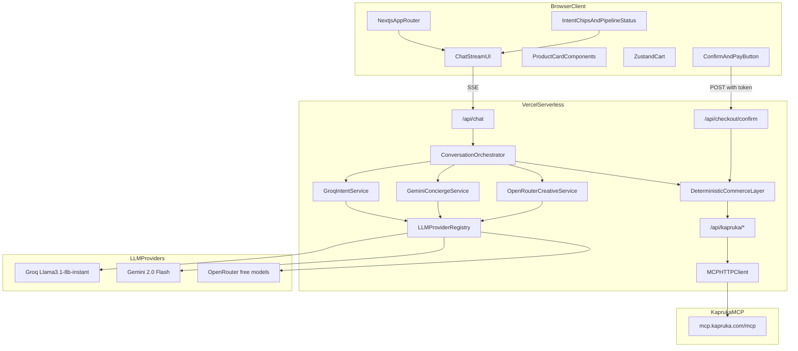
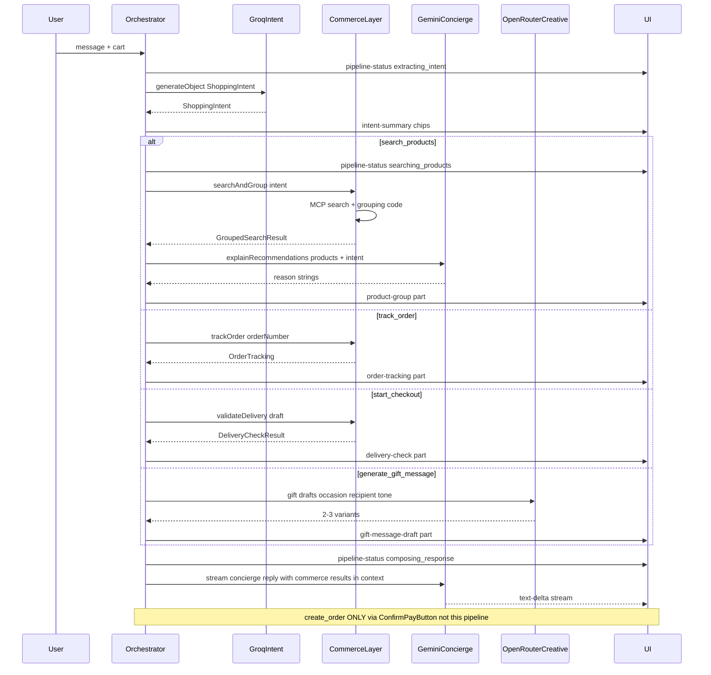
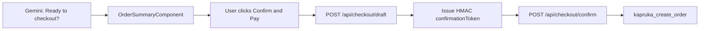

# Kapruka AI Commerce Concierge — Implementation Plan

**Deadline:** 30 June 2026 · **Submission:** live public URL · **MCP endpoint:** `https://mcp.kapruka.com/mcp` (Streamable HTTP, no auth)

This plan aligns with the [Kapruka Agent Challenge rubric](https://www.kapruka.com/contactUs/agentChallenge.html): Experience & polish (30), Visual richness (20), Personality (15), Usefulness (15), End-to-end completeness (15), Creativity (5), plus bonus points for multi-item carts, delivery constraints, gift messaging, Tanglish, and Sinhala.

---

## 1. Product Requirements

### Must-have (P0)


| ID    | Requirement                   | Success criteria                                                                                     |
| ----- | ----------------------------- | ---------------------------------------------------------------------------------------------------- |
| P0-1  | Full-screen conversational UI | Chat is the primary surface; no corner widget; mobile-first responsive layout                        |
| P0-2  | Inline product search results | Search results render as cards inside the message stream, not plain text                             |
| P0-3  | Rich product cards            | Image, name, price (LKR + optional USD), stock badge, recommendation reason, Add/Remove cart actions |
| P0-4  | Product grouping              | Each search renders **Best Match**, **Best Value**, **Premium Pick** sections (1 card each minimum)  |
| P0-5  | Cart management               | Add/remove items, quantity, persistent cart drawer, live subtotal                                    |
| P0-6  | Delivery validation           | City lookup + date availability via MCP before checkout                                              |
| P0-7  | Guest checkout                | Collect recipient/delivery/sender, create order via MCP, show pay link + expiry                      |
| P0-8  | Order tracking                | Accept Kapruka order number post-payment, show status timeline                                       |
| P0-9  | Agent personality             | Named concierge with consistent voice, Sri Lanka–aware tone                                          |
| P0-10 | Server-side MCP               | All Kapruka calls from Next.js API routes (never from browser)                                       |
| P0-11 | Public deploy                 | Stable Vercel URL judges can open immediately                                                        |
| P0-12 | Multi-LLM role separation     | Groq intent, Gemini concierge, optional OpenRouter creative — visible to judges                      |
| P0-13 | Deterministic commerce        | Search, grouping, cart, delivery, checkout, tracking are code-driven, not LLM-decided                |
| P0-14 | Order confirmation gate       | No order created without explicit UI confirmation — LLMs cannot trigger checkout                     |


### Should-have (P1 — bonus rubric points)


| ID   | Requirement             | Notes                                                                                                   |
| ---- | ----------------------- | ------------------------------------------------------------------------------------------------------- |
| P1-1 | Smart upselling         | On remove-from-cart or low basket value, suggest complementary items (deterministic rules + MCP search) |
| P1-2 | Gift message generation | OpenRouter/Gemini drafts; user edits; passed to `kapruka_create_order`                                  |
| P1-3 | Tanglish/Singlish       | Groq extracts language; Gemini mirrors in responses                                                     |
| P1-4 | Sinhala support         | Unicode search via MCP; Sinhala gift message variants                                                   |
| P1-5 | Multi-item cart         | Up to 30 items per MCP limits                                                                           |
| P1-6 | Perishable warnings     | Surface cake/flower/combo freshness warnings from delivery check                                        |
| P1-7 | Cake icing text         | Capture `icing_text` for cake products at checkout                                                      |


### Non-functional

- **Performance:** Intent extraction < 500ms (Groq); first concierge token < 1.5s
- **Reliability:** App works with any single provider key configured
- **Security:** API keys server-only; minimal PII retention
- **Cost:** Target <$10/mo on free tiers (Groq free + Gemini free tier + OpenRouter free models)

---

## 2. User Journey




**Primary flow (happy path):**

1. User opens public URL → full-screen chat with branded header + cart icon
2. Agent introduces itself (e.g. *"Ayubowan! I'm Rani, your Kapruka gift concierge…"*)
3. User describes need (*"appa birthday cake for mom in Kandy, budget 8000, deliver Friday"*)
4. **Groq** extracts structured intent → **orchestrator** runs MCP search + grouping → **Gemini** explains results with personality
5. UI shows intent chips + product cards inline
6. User taps **Add to cart** (UI action, not LLM)
7. Agent confirms cart; **deterministic upsell** may trigger complementary search
8. Agent collects delivery details conversationally; **MCP** validates city/date
9. **OpenRouter** (optional) drafts gift message; user edits
10. Order summary → user clicks **Confirm & Pay** (hard gate) → `kapruka_create_order` → pay link
11. Post-payment tracking via order number

---

## 3. System Architecture




**Key architectural decisions:**

1. **Orchestrator-first, not tool-calling-first**
  - LLMs do **not** call Kapruka MCP directly
  - `[lib/llm/orchestrator.ts](lib/llm/orchestrator.ts)` runs a fixed pipeline: intent → commerce actions → concierge narration
  - Commerce logic lives in `[lib/commerce/](lib/commerce/)` — testable, deterministic, no hallucinated products
2. **Role-separated multi-LLM pipeline**
  - **Groq:** fast structured intent extraction only
  - **Gemini Flash:** conversational concierge + product explanation + checkout guidance
  - **OpenRouter:** optional creative layer for gift messages and tone variants
  - See **Section 8** for full detail
3. **Order creation is UI-gated, not LLM-gated**
  - LLMs never receive a `create_order` tool
  - `[/api/checkout/confirm](app/api/checkout/confirm/route.ts)` is the **only** path to `kapruka_create_order`
  - Requires a server-issued `confirmationToken` bound to a validated checkout draft + explicit user click
4. **Structured UI via message parts**
  - Orchestrator emits typed parts: `intent-summary`, `pipeline-status`, `product-group`, `cart-summary`, etc.
  - Gemini text streams alongside; cards come from deterministic data
5. **Provider resilience**
  - `[lib/llm/provider-registry.ts](lib/llm/provider-registry.ts)` detects available keys at runtime
  - Each role has a fallback chain; app degrades gracefully with one key

---

## 4. Folder / File Structure

```
kapruka-concierge/
├── app/
│   ├── layout.tsx
│   ├── page.tsx
│   ├── globals.css
│   └── api/
│       ├── chat/
│       │   └── route.ts              # SSE stream; delegates to orchestrator
│       ├── checkout/
│       │   ├── draft/route.ts        # Validate + store checkout draft
│       │   └── confirm/route.ts      # ONLY path to create_order (UI gate)
│       └── kapruka/
│           ├── search/route.ts
│           ├── product/route.ts
│           ├── categories/route.ts
│           ├── delivery-cities/route.ts
│           ├── delivery-check/route.ts
│           └── track-order/route.ts  # create-order removed from generic proxy
├── components/
│   ├── chat/
│   │   ├── ChatShell.tsx
│   │   ├── MessageList.tsx
│   │   ├── MessageBubble.tsx
│   │   ├── ChatInput.tsx
│   │   ├── IntentChips.tsx           # Shows extracted intent to judges
│   │   ├── PipelineStatus.tsx        # "Groq → Search → Gemini" stepper
│   │   └── ModelBadge.tsx            # Subtle per-message model attribution
│   ├── products/
│   │   ├── ProductGroup.tsx
│   │   ├── ProductCard.tsx
│   │   └── ProductCarousel.tsx
│   ├── cart/
│   │   ├── CartDrawer.tsx
│   │   ├── CartItemRow.tsx
│   │   └── UpsellBanner.tsx
│   ├── checkout/
│   │   ├── DeliveryForm.tsx
│   │   ├── OrderSummary.tsx
│   │   ├── ConfirmPayButton.tsx      # Hard confirmation gate
│   │   ├── PaymentLinkCard.tsx
│   │   └── GiftMessageEditor.tsx
│   ├── tracking/
│   │   └── OrderTimeline.tsx
│   └── ui/
├── lib/
│   ├── llm/                          # ★ Multi-LLM layer
│   │   ├── provider-registry.ts      # Key detection, role → model mapping
│   │   ├── types.ts                  # IntentSchema, PipelineEvent, ModelRole
│   │   ├── orchestrator.ts           # Main conversation pipeline
│   │   ├── intent/
│   │   │   ├── groq-intent.ts        # Primary intent extractor
│   │   │   ├── gemini-intent-fallback.ts
│   │   │   ├── openrouter-intent-fallback.ts
│   │   │   └── intent-schema.ts      # Zod schema for structured output
│   │   ├── concierge/
│   │   │   ├── gemini-concierge.ts   # Primary streaming concierge
│   │   │   ├── groq-concierge-fallback.ts
│   │   │   └── system-prompt.ts      # Rani personality + language rules
│   │   ├── creative/
│   │   │   ├── openrouter-gift.ts    # Gift message variants
│   │   │   ├── gemini-gift-fallback.ts
│   │   │   └── tone-rewriter.ts      # Tanglish/Sinhala tone polish
│   │   └── explain/
│   │       └── recommendation-copy.ts # Gemini writes 1-line reasons for cards
│   ├── commerce/                     # ★ Deterministic commerce (no LLM)
│   │   ├── search-service.ts         # MCP search + caching
│   │   ├── product-grouping.ts       # Best Match / Value / Premium
│   │   ├── cart-service.ts           # Add/remove/qty validation
│   │   ├── delivery-service.ts       # City resolve + date check
│   │   ├── checkout-service.ts       # Draft validation, token issuance
│   │   ├── upsell-service.ts         # Basket protection rules
│   │   └── tracking-service.ts
│   ├── kapruka/
│   │   ├── mcp-client.ts
│   │   ├── types.ts
│   │   └── cache.ts
│   ├── cart/
│   │   └── store.ts
│   ├── security/
│   │   ├── rate-limit.ts
│   │   ├── sanitize.ts
│   │   └── confirmation-token.ts     # HMAC-signed checkout tokens
│   └── utils.ts
├── .env.example
├── next.config.ts
├── tailwind.config.ts
├── package.json
└── README.md
```

---

## 5. API Routes


| Route                          | Method | Purpose                                            | LLM?              | MCP?                 |
| ------------------------------ | ------ | -------------------------------------------------- | ----------------- | -------------------- |
| `/api/chat`                    | POST   | Pipeline: intent → commerce → concierge stream     | Yes (all 3 roles) | Via commerce layer   |
| `/api/checkout/draft`          | POST   | Validate cart + delivery; issue confirmation token | No                | delivery-check       |
| `/api/checkout/confirm`        | POST   | **Create order** after UI confirmation             | No                | create_order         |
| `/api/kapruka/search`          | POST   | Product search (cached)                            | No                | search_products      |
| `/api/kapruka/product`         | GET    | Product detail                                     | No                | get_product          |
| `/api/kapruka/categories`      | GET    | Categories                                         | No                | list_categories      |
| `/api/kapruka/delivery-cities` | GET    | City autocomplete                                  | No                | list_delivery_cities |
| `/api/kapruka/delivery-check`  | POST   | Delivery feasibility                               | No                | check_delivery       |
| `/api/kapruka/track-order`     | GET    | Order tracking                                     | No                | track_order          |


`**/api/chat` request body:**

```typescript
{
  messages: UIMessage[];
  cart: CartState;
  sessionContext?: { checkoutDraftId?: string };
}
```

`**/api/chat` stream events:**

```typescript
type StreamEvent =
  | { type: "pipeline-status"; step: PipelineStep; model?: string }
  | { type: "intent-summary"; data: ShoppingIntent }
  | { type: "text-delta"; delta: string; model: string }
  | { type: "product-group"; data: GroupedSearchResult }
  | { type: "cart-summary"; data: CartSummary }
  | { type: "delivery-check"; data: DeliveryCheckResult }
  | { type: "gift-message-draft"; data: GiftMessageDraft; model: string }
  | { type: "checkout-draft-ready"; draftId: string }
  | { type: "order-tracking"; data: OrderTracking };
```

`**/api/checkout/confirm` request body:**

```typescript
{
  draftId: string;
  confirmationToken: string;  // server-issued, single-use, 10-min TTL
}
```

---

## 6. Data Structures

### Shopping intent (Groq output — Zod-validated)

```typescript
interface ShoppingIntent {
  primaryAction:
    | "search_products"
    | "add_to_cart"
    | "remove_from_cart"
    | "view_cart"
    | "start_checkout"
    | "provide_delivery_info"
    | "generate_gift_message"
    | "confirm_order"       // detected but NEVER triggers create_order
    | "track_order"
    | "general_chat";
  occasion?: string;          // birthday, anniversary, wedding, sympathy…
  recipient?: string;         // mom, wife, friend, colleague…
  budget?: { min?: number; max?: number; currency: string };
  city?: string;
  deliveryDate?: string;      // ISO date or relative ("friday", "tomorrow")
  category?: string;
  urgency?: "low" | "medium" | "high";
  language: "en" | "si" | "ta" | "tanglish" | "singlish";
  searchQuery?: string;       // normalized MCP search string
  productReference?: string;  // "the chocolate one", product name fragment
  orderNumber?: string;       // for tracking
  confidence: number;         // 0–1; below 0.6 → ask clarifying question
  rawSlots: Record<string, string>;  // for intent chip UI
}
```

### Product, cart, checkout, tracking

(Same as prior plan — see interfaces in sections 6 of original: `KaprukaProduct`, `GroupedSearchResult`, `CartState`, `CheckoutDraft`, `CheckoutResult`, `OrderTracking`.)

**Change:** `ProductCardPayload.recommendationReason` is generated by **Gemini explain layer** (`[lib/llm/explain/recommendation-copy.ts](lib/llm/explain/recommendation-copy.ts)`) using only deterministic product facts — not free-form search.

### Chat message parts (extended for judge visibility)

```typescript
type MessagePart =
  | { type: "text"; text: string; model?: string }
  | { type: "intent-summary"; data: ShoppingIntent; extractedBy: string }
  | { type: "pipeline-status"; steps: PipelineStep[] }
  | { type: "product-group"; data: GroupedSearchResult }
  | { type: "cart-summary"; data: CartSummary & { items: CartItem[] } }
  | { type: "delivery-check"; data: DeliveryCheckResult }
  | { type: "gift-message-draft"; data: { drafts: string[]; tone: string }; model: string }
  | { type: "checkout-draft-ready"; data: { draftId: string; summary: OrderSummary } }
  | { type: "checkout-link"; data: CheckoutResult }
  | { type: "order-tracking"; data: OrderTracking };

type PipelineStep =
  | "extracting_intent"
  | "searching_products"
  | "grouping_results"
  | "checking_delivery"
  | "drafting_gift_message"
  | "composing_response";
```

---

## 7. MCP Tool Integration Plan

(Unchanged core — all MCP calls go through `[lib/commerce/](lib/commerce/)`, never through LLM tools.)


| MCP Tool                       | Invoked by                                                 | When                                         |
| ------------------------------ | ---------------------------------------------------------- | -------------------------------------------- |
| `kapruka_search_products`      | `search-service.ts`                                        | Intent = search; upsell needs alternatives   |
| `kapruka_get_product`          | `search-service.ts`                                        | Card expand; pre-checkout stock verify       |
| `kapruka_list_categories`      | `search-service.ts`                                        | Browse intent; upsell category mapping       |
| `kapruka_list_delivery_cities` | `delivery-service.ts`                                      | City autocomplete; intent city normalization |
| `kapruka_check_delivery`       | `delivery-service.ts`                                      | Before checkout draft; date/city change      |
| `kapruka_create_order`         | `checkout-service.ts` via `/api/checkout/confirm` **only** | After UI Confirm & Pay                       |
| `kapruka_track_order`          | `tracking-service.ts`                                      | Intent = track_order                         |


**Hard rule:** Remove `create-order` from generic Kapruka proxy. Order creation is a dedicated, audited route.

---

## 8. LLM Orchestration Plan (Multi-LLM Architecture)

### Design principle

> **LLMs talk. Code trades.**

Models handle language, empathy, and explanation. All catalog, cart, delivery, checkout, and tracking operations run in deterministic TypeScript against Kapruka MCP.

### Model roles


| Role                  | Primary model                                                                     | Purpose                                                      | Output                      |
| --------------------- | --------------------------------------------------------------------------------- | ------------------------------------------------------------ | --------------------------- |
| **Intent**            | Groq `llama-3.1-8b-instant`                                                       | Fast slot-filling from user message                          | `ShoppingIntent` JSON (Zod) |
| **Concierge**         | Gemini `gemini-2.0-flash`                                                         | Streaming natural reply, Tanglish/Sinhala, checkout guidance | Streamed text               |
| **Explain**           | Gemini `gemini-2.0-flash`                                                         | One-line recommendation reasons per product card             | String[]                    |
| **Creative**          | OpenRouter `google/gemma-2-9b-it:free` or `meta-llama/llama-3.2-3b-instruct:free` | Gift message drafts (2–3 variants), tone rewrite             | String[]                    |
| **Creative fallback** | Gemini Flash                                                                      | Gift messages when OpenRouter unavailable                    | String[]                    |


### Pipeline (every user message)




### When each model is called


| Trigger                    | Model       | Call type                          | Skipped if                                |
| -------------------------- | ----------- | ---------------------------------- | ----------------------------------------- |
| Every user message         | Groq        | `generateObject` (intent)          | Never (fallback to Gemini)                |
| After product search       | Gemini      | `generateObject` (3 short reasons) | No search results                         |
| Every user message (final) | Gemini      | `streamText` (concierge)           | Never (fallback to Groq)                  |
| Gift message requested     | OpenRouter  | `generateText` (2–3 drafts)        | User declines gift message                |
| Gift tone polish           | OpenRouter  | `generateText`                     | OpenRouter unavailable → Gemini           |
| Clarifying question        | Gemini only | `streamText`                       | Intent confidence ≥ 0.6 with clear action |


**Groq is NOT used for:** product search, cart mutations, delivery checks, order creation, or long conversational replies.

**Gemini is NOT used for:** intent when Groq is available (keeps Groq fast path), order creation, MCP calls.

**OpenRouter is NOT used for:** anything on the critical path except gift messages and optional tone polish.

### LLM layer files


| File                                                                                           | Responsibility                                                |
| ---------------------------------------------------------------------------------------------- | ------------------------------------------------------------- |
| `[lib/llm/provider-registry.ts](lib/llm/provider-registry.ts)`                                 | Read env keys; expose `getProvider(role)` with fallback chain |
| `[lib/llm/types.ts](lib/llm/types.ts)`                                                         | Shared types: `ModelRole`, `PipelineEvent`, provider config   |
| `[lib/llm/orchestrator.ts](lib/llm/orchestrator.ts)`                                           | Main pipeline coordinator; no provider-specific logic         |
| `[lib/llm/intent/groq-intent.ts](lib/llm/intent/groq-intent.ts)`                               | Groq structured intent extraction                             |
| `[lib/llm/intent/intent-schema.ts](lib/llm/intent/intent-schema.ts)`                           | Zod schema + prompt template for intent                       |
| `[lib/llm/intent/gemini-intent-fallback.ts](lib/llm/intent/gemini-intent-fallback.ts)`         | Fallback intent when Groq key missing/fails                   |
| `[lib/llm/intent/openrouter-intent-fallback.ts](lib/llm/intent/openrouter-intent-fallback.ts)` | Last-resort intent extraction                                 |
| `[lib/llm/concierge/gemini-concierge.ts](lib/llm/concierge/gemini-concierge.ts)`               | Streaming concierge responses                                 |
| `[lib/llm/concierge/groq-concierge-fallback.ts](lib/llm/concierge/groq-concierge-fallback.ts)` | Shorter replies when Gemini unavailable                       |
| `[lib/llm/concierge/system-prompt.ts](lib/llm/concierge/system-prompt.ts)`                     | Rani personality; language mirroring rules                    |
| `[lib/llm/creative/openrouter-gift.ts](lib/llm/creative/openrouter-gift.ts)`                   | Gift message generation                                       |
| `[lib/llm/creative/gemini-gift-fallback.ts](lib/llm/creative/gemini-gift-fallback.ts)`         | Gift fallback                                                 |
| `[lib/llm/creative/tone-rewriter.ts](lib/llm/creative/tone-rewriter.ts)`                       | Tanglish/Sinhala tone variants                                |
| `[lib/llm/explain/recommendation-copy.ts](lib/llm/explain/recommendation-copy.ts)`             | Card recommendation one-liners                                |


### Fallback behavior (single-key resilience)

**Env vars:** `GROQ_API_KEY`, `GOOGLE_GENERATIVE_AI_API_KEY`, `OPENROUTER_API_KEY` (all optional individually; at least one required).


| Available keys  | Intent          | Concierge                        | Gift messages          | Explain reasons |
| --------------- | --------------- | -------------------------------- | ---------------------- | --------------- |
| All three       | Groq            | Gemini                           | OpenRouter → Gemini    | Gemini          |
| Groq only       | Groq            | Groq (concierge fallback prompt) | Groq (simple template) | Groq (short)    |
| Gemini only     | Gemini          | Gemini                           | Gemini                 | Gemini          |
| OpenRouter only | OpenRouter free | OpenRouter free                  | OpenRouter free        | OpenRouter free |


**Failure within a role:**

1. Try primary provider (2 retries, 500ms backoff)
2. Fall back to next provider in role chain
3. If all fail for intent: use regex/heuristic extractor (`[lib/llm/intent/heuristic-fallback.ts](lib/llm/intent/heuristic-fallback.ts)`) — keyword match for track/order/search/checkout
4. If all fail for concierge: return templated response with commerce data (app still functional, cards still render)

**Startup validation:** `/api/chat` logs active providers (server-side only); README documents minimum `GOOGLE_GENERATIVE_AI_API_KEY` OR `GROQ_API_KEY`.

### Order confirmation gate (non-negotiable)




- Intent slot `confirm_order` from Groq **does not** call MCP — it only advances UI to summary step
- Gemini system prompt explicitly forbids claiming an order was placed
- `confirmationToken` is single-use, bound to `draftId`, expires in 10 minutes

### UI: making intelligence visible to judges

Judges score **Experience (30)**, **Personality (15)**, and **Creativity (5)**. Surface the multi-LLM pipeline as a feature, not debug noise.


| UI element                 | Component               | What judges see                                                                                                                       |
| -------------------------- | ----------------------- | ------------------------------------------------------------------------------------------------------------------------------------- |
| **Intent chips**           | `IntentChips.tsx`       | Pills above agent reply: `Birthday` · `Kandy` · `LKR 8,000` · `Tanglish` — labeled *"Understood by Groq"*                             |
| **Pipeline stepper**       | `PipelineStatus.tsx`    | Animated 3-step bar during processing: `Understanding → Searching Kapruka → Composing reply` with ~300ms min display so it's readable |
| **Model badge**            | `ModelBadge.tsx`        | Small footer on agent bubble: `Rani · Gemini Flash`                                                                                   |
| **Gift draft attribution** | `GiftMessageEditor.tsx` | Header: *"3 message ideas · OpenRouter"* with tabs to switch variants                                                                 |
| **Recommendation labels**  | `ProductCard.tsx`       | Subtle *"Why this pick"* line with Gemini-generated reason; group badge `Best Value` from code                                        |
| **Confirm gate**           | `ConfirmPayButton.tsx`  | Prominent button: *"Confirm & Pay on Kapruka"* — copy explains LLM cannot place orders                                                |
| **Optional expand**        | `PipelineDetails.tsx`   | Collapsible *"How Rani decided this"* showing intent JSON + which commerce steps ran (appeals to tech judges)                         |


**Demo tip for README:** Include a prompt that triggers all visible stages: *"machan, amma birthday cake, Kandy, 8000 budget, friday deliver"* — judges will see Groq chips populate, search stepper run, then Tanglish Gemini reply with grouped cards.

### Suggested improvements beyond your spec

These strengthen the competition story without violating deterministic commerce:

1. **Keep Groq strictly on intent** — do not promote Groq to concierge except as fallback. Its value is sub-500ms structured extraction that makes the app feel instant.
2. **Use Gemini Explain as a separate micro-call** — batch all 3 recommendation reasons in one `generateObject` call after grouping. Ground prompt in product facts only (*"Do not invent features"*) to prevent hallucinated recommendations.
3. **OpenRouter for Sinhala gift variants only** — generate one English, one Sinhala, one Tanglish draft. Strong bonus-point play without touching commerce logic.
4. **Heuristic intent fallback** — regex for order numbers (`VIMP…`) and checkout keywords so tracking works even if all LLMs fail.
5. **Do NOT use LLM for upsell product selection** — `[lib/commerce/upsell-service.ts](lib/commerce/upsell-service.ts)` uses hardcoded category pairs (cake → flowers, flowers → chocolates) + MCP search. Gemini only *explains* the suggestion.

---

## 9. Security Checklist

- [ ] **Secrets:** `GROQ_API_KEY`, `GOOGLE_GENERATIVE_AI_API_KEY`, `OPENROUTER_API_KEY`, `CHECKOUT_TOKEN_SECRET` in Vercel env only
- [ ] **No LLM order creation:** `create_order` only in `/api/checkout/confirm`; no LLM tool exposure
- [ ] **Confirmation tokens:** HMAC-signed, single-use, short TTL
- [ ] **MCP proxy:** Browser never calls Kapruka directly
- [ ] **PII:** No phone/address/gift messages in logs or LLM telemetry
- [ ] **Rate limiting:** Per-IP on `/api/chat` and `/api/checkout/confirm`
- [ ] **Input validation:** Zod on all routes; MCP phone/date rules enforced in commerce layer

---

## 10. Build Phases (Restructured)

Each phase ends with a **verifiable demo milestone** — the app should be runnable and testable before moving on.

### Phase 0 — Foundation

**Goal:** Empty app shell with provider infrastructure.

- [ ] Create Next.js 15 + Tailwind + TypeScript project
- [ ] Add shadcn/ui, Kapruka brand tokens, Noto Sans Sinhala font
- [ ] Build `ChatShell` full-screen layout, header, cart icon placeholder
- [ ] Implement `lib/llm/provider-registry.ts` + `.env.example` with all 3 keys
- [ ] Add startup key detection test script

**Milestone:** App loads full-screen; provider registry logs which roles are active.

---

### Phase 1 — Kapruka + Deterministic Commerce

**Goal:** All MCP operations work through code, zero LLM.

- [ ] Implement `mcp-client.ts` + all `/api/kapruka/*` routes (except create-order)
- [ ] Build `search-service`, `product-grouping`, `delivery-service`, `tracking-service`
- [ ] Build `cart-service` + Zustand store + `CartDrawer`
- [ ] Unit test grouping algorithm with mock MCP JSON

**Milestone:** Manual API tests return grouped products, delivery checks, tracking — no chat yet.

---

### Phase 2 — Multi-LLM Orchestrator Core

**Goal:** Pipeline runs intent → commerce → (no concierge stream yet).

- [ ] Implement `intent-schema.ts`, `groq-intent.ts`, fallback chain
- [ ] Implement `orchestrator.ts` with action routing from `ShoppingIntent`
- [ ] Wire orchestrator to commerce services based on intent
- [ ] Implement heuristic intent fallback
- [ ] Build `/api/chat` returning JSON events (no stream yet)

**Milestone:** POST to `/api/chat` returns `intent-summary` + `product-group` events for a search message.

---

### Phase 3 — Concierge UI + Intelligence Visibility

**Goal:** Full chat experience with judge-visible pipeline.

- [ ] Implement `gemini-concierge.ts` streaming + `recommendation-copy.ts`
- [ ] Upgrade `/api/chat` to SSE with all stream event types
- [ ] Build `MessageList`, `IntentChips`, `PipelineStatus`, `ModelBadge`
- [ ] Build `ProductCard`, `ProductGroup`, wire add/remove to cart
- [ ] Connect chat input → streamed response

**Milestone:** End-to-end chat: user message → intent chips → stepper → product cards → Gemini reply. Works with Groq+Gemini or Gemini-only.

---

### Phase 4 — Checkout + Confirmation Gate

**Goal:** Complete purchase flow with hard LLM isolation from order creation.

- [ ] Build `checkout-service`, `confirmation-token.ts`
- [ ] Implement `/api/checkout/draft` and `/api/checkout/confirm`
- [ ] Build `DeliveryForm`, `OrderSummary`, `ConfirmPayButton`, `PaymentLinkCard`
- [ ] Orchestrator handles checkout intents → draft ready event (not create_order)
- [ ] Pre-checkout MCP stock re-validation

**Milestone:** Full flow through pay link; verify LLM cannot create order without button click.

---

### Phase 5 — Creative Layer + Upsell + Polish

**Goal:** Bonus rubric features and production polish.

- [ ] Implement `openrouter-gift.ts` + `GiftMessageEditor` with 3 variants
- [ ] Implement `upsell-service.ts` (deterministic) + `UpsellBanner`
- [ ] Tanglish/Sinhala system prompt tuning; language mirroring from intent
- [ ] Order tracking UI + `OrderTimeline`
- [ ] Error states, mobile QA, loading skeletons
- [ ] Optional `PipelineDetails` expand for tech judges

**Milestone:** Demo script works: Tanglish search → upsell on remove → gift drafts → checkout → track.

---

### Phase 6 — Ship

**Goal:** Public deployment and challenge submission.

- [ ] Vercel production deploy with env vars
- [ ] Security audit (no keys in bundle, confirm gate tested)
- [ ] README: live URL, judge demo script, architecture diagram, env setup
- [ ] Register + submit before **30 June 2026**

**Milestone:** Judges can open URL and complete full shopping flow.

---

## 11. Testing Checklist

### Multi-LLM pipeline

- [ ] Groq extracts intent from Tanglish message correctly
- [ ] Intent chips render with occasion/city/budget/language
- [ ] Pipeline stepper shows during processing
- [ ] Gemini-only fallback: app works with only `GOOGLE_GENERATIVE_AI_API_KEY`
- [ ] Groq-only fallback: app works with only `GROQ_API_KEY` ( degraded concierge OK)
- [ ] All-LLM-fail: heuristic intent + templated reply + product cards still work

### Commerce (deterministic)

- [ ] Grouping produces Best Match / Best Value / Premium Pick
- [ ] Upsell fires on cart remove with deterministic category pair
- [ ] Delivery check blocks invalid dates
- [ ] Order created ONLY via Confirm & Pay button

### UI / UX

- [ ] Full-screen mobile + desktop
- [ ] Model badge shows on agent messages
- [ ] Gift message shows OpenRouter attribution when used

### Security

- [ ] No API keys in client bundle
- [ ] `/api/checkout/confirm` rejects missing/invalid token
- [ ] PII absent from logs

---

## 12. Deployment Checklist

- [ ] GitHub repo connected to Vercel
- [ ] Env vars: at minimum one of `GROQ_API_KEY` / `GOOGLE_GENERATIVE_AI_API_KEY`; recommend all three
- [ ] `CHECKOUT_TOKEN_SECRET` set (random 32+ bytes)
- [ ] `next.config.ts`: Kapruka image domains allowed
- [ ] Production smoke test with judge demo script
- [ ] Submit live URL before **30 June 2026 EOD**

---

## Judge demo script

1. *"machan, amma birthday cake, Kandy, 8000 budget, friday deliver"* → watch intent chips + pipeline + grouped cards + Tanglish reply
2. Add Best Value card to cart → ask *"anything else to go with this?"* → see upsell
3. *"write a gift message, make it sweet but short"* → 3 OpenRouter/Gemini drafts
4. Complete checkout → click **Confirm & Pay** → pay link appears
5. *"track order VIMP34456CB2"* → timeline UI

This architecture separates **speed** (Groq intent), **personality** (Gemini concierge), and **creativity** (OpenRouter gifts) while keeping **commerce trustworthy** (deterministic code + MCP) — a strong competition narrative for both technical and experience judges.